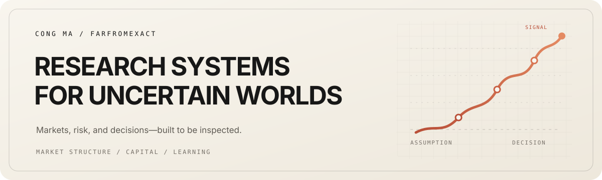

<picture>
  <source media="(prefers-color-scheme: dark)" srcset="./assets/header-dark.svg">
  <source media="(prefers-color-scheme: light)" srcset="./assets/header-light.svg">
  
</picture>

  <strong>Market research systems built for evidence, review, and judgment.</strong>

  <a href="https://farfromexact.github.io">Research systems</a>
  &nbsp;&middot;&nbsp;
  <a href="https://github.com/farfromexact?tab=repositories">All repositories</a>

I build auditable research systems for China equities, index options, commodities, and cross-asset portfolio review. The work starts with reliable source data and ends with a conclusion that can be rechecked: source date, transformations, caveats, and result stay connected.

### Operating areas

<table>
  <tr>
    <td width="33%" valign="top">
      <strong>Data foundations</strong>  
      Point-in-time A-share, CFFEX options, and commodity futures datasets with provenance, coverage checks, and usable daily releases.
    </td>
    <td width="33%" valign="top">
      <strong>Market research</strong>  
      Cross-asset reports, regime views, and derivative positioning that separate evidence from interpretation.
    </td>
    <td width="33%" valign="top">
      <strong>Portfolio &amp; capital</strong>  
      Review workflows, solvency scenarios, and capital tools that turn operating questions into traceable analysis.
    </td>
  </tr>
</table>

### Selected systems

<table>
  <tr>
    <td width="50%" valign="top">
      <a href="https://github.com/farfromexact/Global-Cross-Asset-Radar"><strong>Global Cross-Asset Radar</strong></a> 
      An evolving report archive that brings macro, futures, commodities, FX, volatility, and options context into one research surface.  
      Python &middot; Reports &middot; Cross-asset research
    </td>
    <td width="50%" valign="top">
      <a href="https://github.com/farfromexact/China-Stock-Engine"><strong>China Stock Engine</strong></a> 
      A point-in-time A-share market and reference-data foundation with source-date checks, coverage controls, and auditable daily outputs.  
      Python &middot; PIT data &middot; Quality gates
    </td>
  </tr>
  <tr>
    <td width="50%" valign="top">
      <a href="https://github.com/farfromexact/China-Options-Engine"><strong>China Options Engine</strong></a> 
      An engine that turns CFFEX futures and option-chain data into implied volatility, Greeks, gamma exposure, and daily state.  
      Python &middot; CFFEX &middot; IV and Greeks
    </td>
    <td width="50%" valign="top">
      <a href="https://github.com/farfromexact/China-Commodities-Engine"><strong>China Commodities Engine</strong></a> 
      An EOD China commodity futures foundation with explicit provenance, quality gates, and research-ready market surfaces.  
      Python &middot; Commodity futures &middot; EOD
    </td>
  </tr>
  <tr>
    <td width="50%" valign="top">
      <a href="https://github.com/farfromexact/stats"><strong>Portfolio Review</strong></a> 
      A monthly portfolio-review workflow from Excel snapshots to traceable Parquet releases, analytics, and asset-level evidence.  
      Python &middot; Parquet &middot; Portfolio analytics
    </td>
    <td width="50%" valign="top">
      <a href="https://github.com/farfromexact/Solvency"><strong>Solvency</strong></a> 
      An insurance solvency and asset-allocation workbench for historical review, scenario shocks, target solving, and capital attribution.  
      Python &middot; Streamlit &middot; Scenario analysis
    </td>
  </tr>
</table>

### Working principles

**Evidence before signal.** Keep source dates, transformations, assumptions, and data gaps visible. Build the smallest useful system that can still be challenged and rechecked; keep sensitive data local where appropriate.

  Research and educational software. No repository here is an order-generation system or investment advice.

